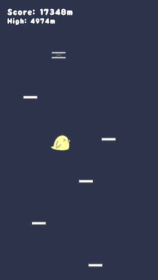

# とりジャンプ (TORI JUMP)

とりジャンプは、かわいいインコのキャラクターが出演するシンプルなゲームです。プレイヤーは、スマホを傾けてランダムに出現する床を踏んでハイスコアを目指します。

## スクリーンショット

||||
|---|---|---|

## Google Play で入手

## ゲームの特徴

- シンプルな操作で誰でも楽しめる
- かわいいインコのキャラクターが登場
- オンラインランキングで全世界のプレイヤーと競い合える

## 開発環境

- Unity 2022.2.8f1
- C# スクリプト
- Android ビルドサポート
- ニフクラ mobile backend

## クレジット

とりジャンプは、以下のリソースを使用して開発されました。

### BGM

- [Springin’ Sound Stock](https://www.springin.org/)
- [OtoLogic](<https://otologic.jp>)

### 効果音

- [taira-komori](https://taira-komori.jpn.org/)

### フォント

- [ふんわりラウンド](<https://suzukimemo.com/post-1302>)
- [源柔ゴシック](http://jikasei.me/font/genjyuu/)
